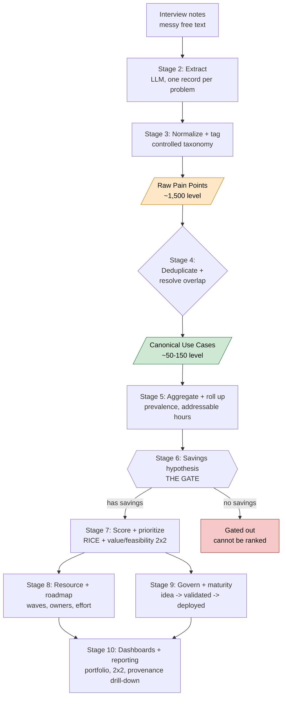
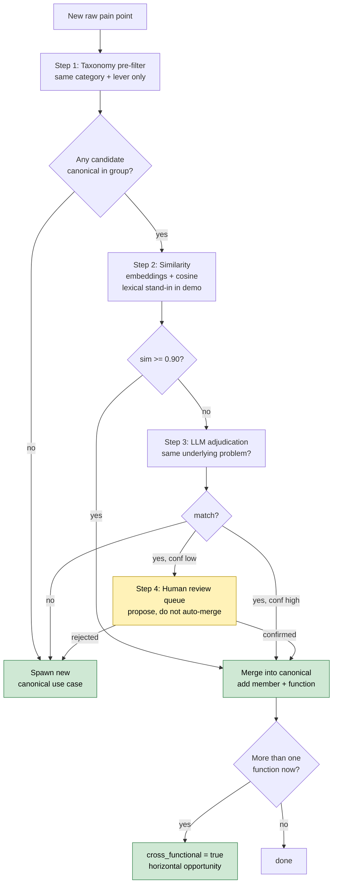
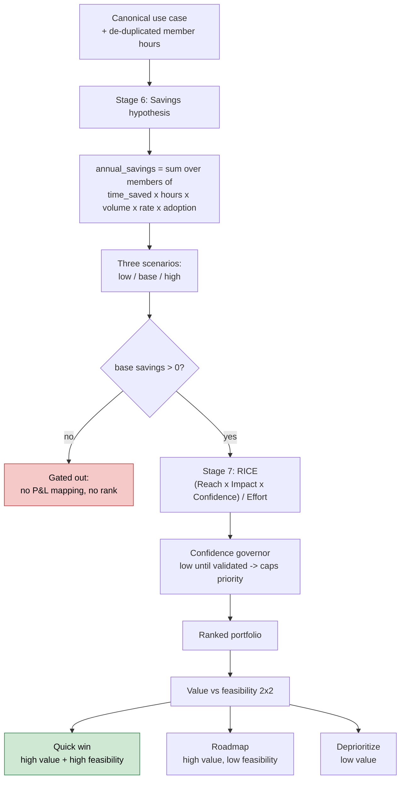

# Lens workflow flowcharts

Mermaid diagrams of the pipeline. They render on GitHub, in VS Code (Markdown
Preview Mermaid extension), or at mermaid.live. Three views:

1. End-to-end pipeline (the ten stages, raw vs canonical layers)
2. The Stage 4 dedup + overlap cascade (the hard part)
3. Savings gate + RICE scoring

---

## 1. End-to-end pipeline

The two sacred layers are colored: raw pain points (the ~1,500 level) feed the
bridge at Stage 4, which produces canonical use cases (the ~50-150 decision
level). Only canonical use cases are ever prioritized.

---

## 2. Stage 4: deduplicate + resolve overlap (the cascade)

For each raw pain point, a four-step cascade decides whether it joins an
existing canonical use case or starts a new one. Confidence is recorded at every
step; low-confidence merges never happen silently, they route to a human.

Key guarantees:
- No double-counting: scope aggregates on the canonical use case, not on raw
  points. Two pain points describing the same hours are counted once.
- Provenance preserved: every canonical keeps `member_pain_ids` and the source
  interviews, so any number drills back to its origin.
- Cross-function reach becomes a priority signal in Stage 7.

---

## 3. Savings gate + RICE scoring (Stages 6-7)

